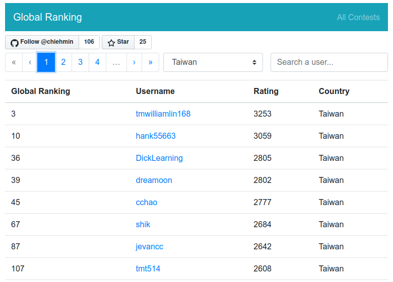

# Leetcode Contest Ranking Searcher

[](https://github.com/chiehmin/leetcode-ranking-search/actions)
[](https://github.com/chiehmin/leetcode-ranking-search/blob/master/LICENSE)

Website: https://fatminmin.com/leetcode-ranking-search/

Official Leetcode contest ranking page lacks advance search/filter functions. So I implemented one!!

Features:

- Search users contest ranking history
- Filter ranking data by username and country

The contest data is updated every week by setting up a scheduled pipeline using Github Actions. And the site is purely static which can be served on any web server directly!!

The UI is made with [Vue.js](https://vuejs.org/) and [BootstrapVue](https://bootstrap-vue.js.org/).

## Screenshots

User contest history search:


Contest user search:


Global ranking with country filter:



## Crawling contest results

By simply executing the crawler scripts, the contest ranking results will be parsed and saved.

```sh
# crawling a single contest ranking result
./crawler.py weekly-contest-179

# crawling global ranking
./global_ranking_crawler.py
```