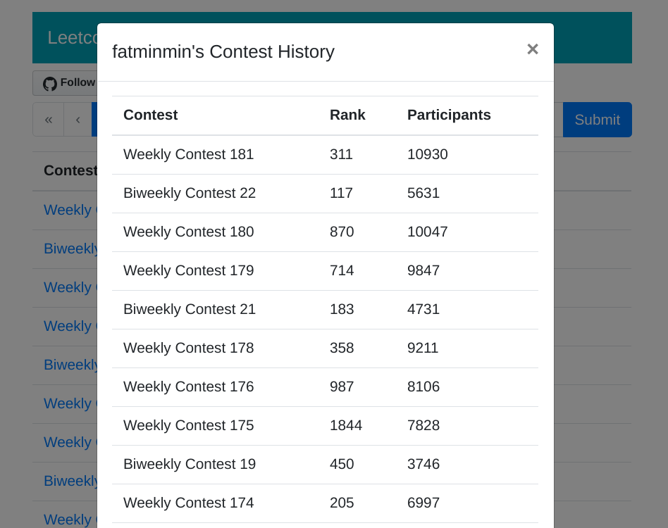
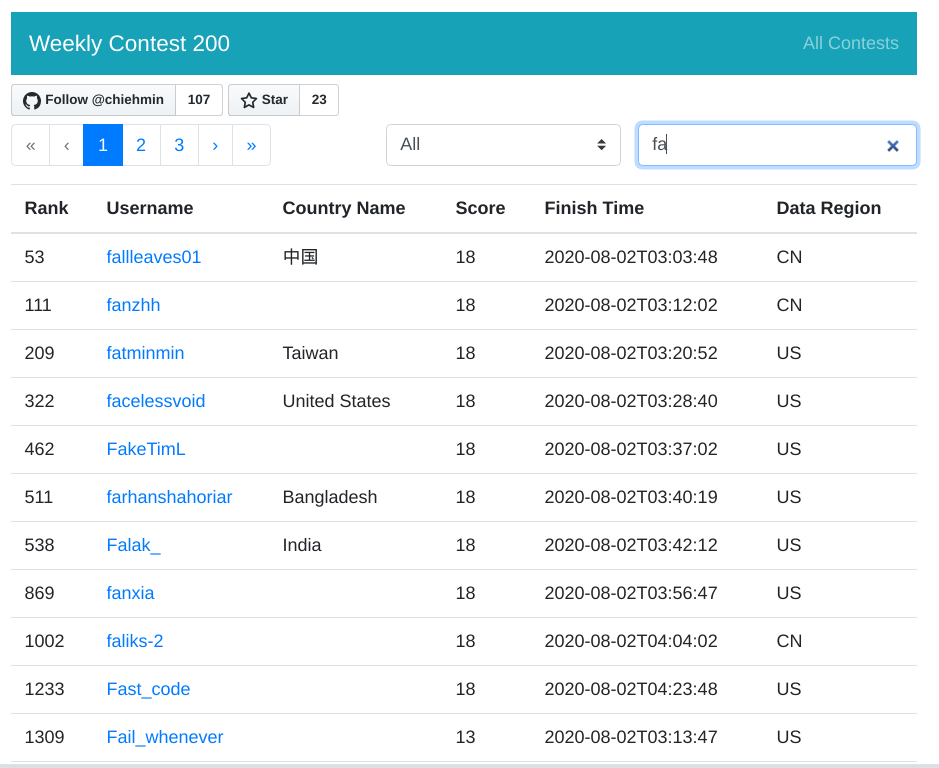
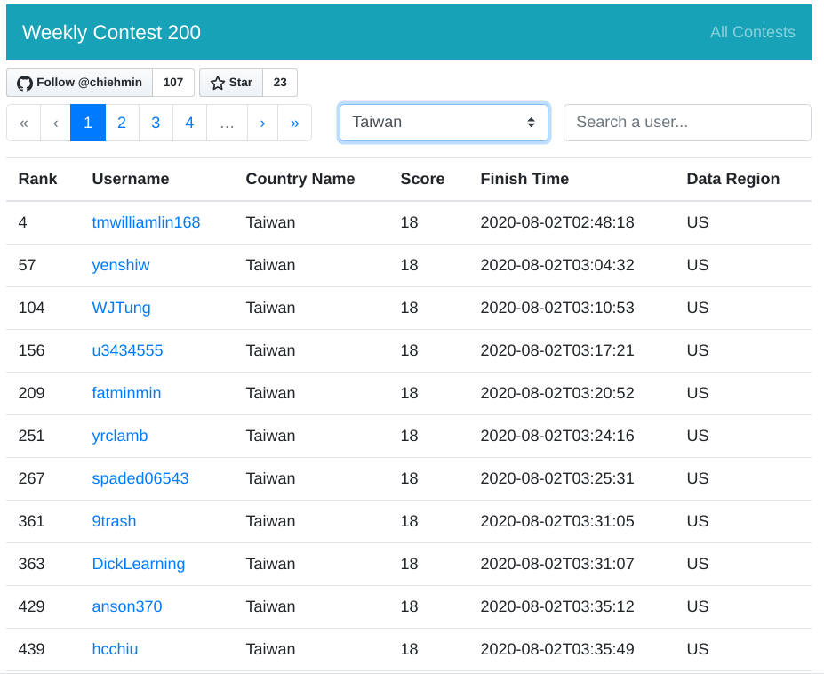

# Leetcode Contest Ranking Searcher

[](https://github.com/chiehmin/leetcode-ranking-search/actions)

Website: https://fatminmin.com/leetcode-ranking-search/

Leetcode contest ranking page lacks a search bar to search for the ranking of a specific user. So I implemented one.

Besides searching a username in a contest, I also implemented a feature to search the ranking history among contests for a user!!

The contest data is updated every week by setting up a scheduled pipeline using Github Actions.

## Crawling contest results

By simply executing the `crawler.py` script, the contest results will be parsed and saved into `data/<contest>.json`.

```sh
# crawling results of weekly contest 179
./crawler.py weekly-contest-179
```

## Web UI

The website is purely static which can be served on any web server directly!!

The UI is made with [Vue.js](https://vuejs.org/) and [BootstrapVue](https://bootstrap-vue.js.org/).

User contest history search:



Contest user search:



Contest country filter:


